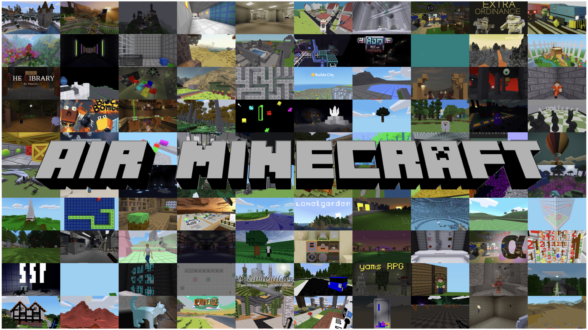

# Air Minecraft

<p align="center">
  
</p>

<p align="center">
  <a href="https://choucisan.github.io/collections/airminecraft/"></a>
  <a href="https://www.xiaohongshu.com/explore/6a13ab6f000000000702d3f6?xsec_token=ABqxXntvO7sqiKi77OGrjveITsZV-SWLhtQGQS29q5vqY"></a>
  <a href="https://www.bilibili.com/video/BV1Z6Gs6NEyH/"></a>
  <a href="https://www.gnu.org/licenses/old-licenses/lgpl-2.1.en.html"></a>
</p>

---

## Acknowledgments

Air Minecraft is built upon **[Luanti](https://www.luanti.org/)** (formerly Minetest), a free open-source voxel game engine. We extend our deepest gratitude to Perttu Ahola (celeron55) and the entire Luanti community for creating and maintaining this incredible platform over the past decade.

- **Luanti Engine**: [https://github.com/luanti-org/luanti](https://github.com/luanti-org/luanti)
- **ContentDB**: [https://content.luanti.org](https://content.luanti.org) — a rich ecosystem of community-created games, mods, and texture packs

We hope Air Minecraft can serve as a bridge between the Minecraft AI research community and the Luanti ecosystem, bringing more attention and contributions to open-source voxel platforms.

---

## Motivation

With the rapid advancement of **Spatial Intelligence** and **Embodied AI**, models like World-Action Models (WAM) and Vision-Language-Action (VLA) models are gaining significant traction. In the UAV domain, researchers often rely on **AirSim** for simulation. However, AirSim's large-scale, pre-built environments offer limited creative flexibility and require substantial computational resources.

In contrast, Minecraft's block-based world provides:
- **Infinite creative possibilities** — users can build, modify, and share any environment
- **Lightweight and accessible** — runs efficiently on consumer hardware
- **Rich community content** — thousands of pre-built worlds and structures via ContentDB
- **Programmable interactions** — Lua scripting and a flexible mod API

**Air Minecraft** reimagines the Minecraft-style engine for aerial robotics research, offering a **6-DOF free-flight drone** with first-person and third-person views, navigation systems, and a foundation for reinforcement learning.

---

## Features

### Drone Mode

A dedicated 6-DOF free-flight drone experience:

| Feature | Description |
|---|---|
| **6-DOF Flight** | Full yaw / pitch / roll control with smooth interpolation |
| **5 Camera Views** | Front, Back, Left, Right, Bottom — all in first-person |
| **First / Third Person** | Toggle between immersive first-person and model-visible third-person views |
| **3D Drone Model** | Realistic drone OBJ model with texture rendering |
| **Navigation System** | Set waypoint targets on a minimap; see distance and direction in the HUD |
| **Large Map Overlay** | Click-to-navigate on an expanded map view |
| **HUD Panel** | Real-time telemetry: altitude, speed, position, yaw/pitch/roll, nav distance |

### Normal Mode

The original Luanti gameplay is fully preserved. Players can create, build, mine, craft, and explore worlds using the standard human character model. Worlds and structures created in normal mode can be shared and used as flight environments in drone mode.

### ContentDB Integration

Air Minecraft is compatible with [ContentDB](https://content.luanti.org), giving access to thousands of community-created:
- Games and subgames
- Mods and extensions
- Texture packs
- Pre-built worlds and maps

---

## Controls

### Drone Mode

| Key | Action |
|---|---|
| **W A S D** | Move forward / left / backward / right |
| **Space** | Ascend |
| **Shift** | Descend |
| **Mouse** | Look / Yaw & Pitch |
| **C** | Switch between 5 camera views (Front → Back → Left → Right → Bottom) |
| **T** | Toggle 1st / 3rd person |
| **R / F** | Roll left / right |
| **H** | Toggle HUD panel |
| **+ / -** | Map zoom in / out |
| **Esc** | Pause menu (set nav target, settings, etc.) |

### Normal Mode

| Key | Action |
|---|---|
| **W A S D** | Move |
| **Space** | Jump |
| **Shift** | Sneak |
| **Mouse** | Look around |
| **Left Click** | Dig / Punch |
| **Right Click** | Place / Use |
| **I** | Inventory |
| **C** | Cycle camera (1st / 3rd / 3rd-front) |
| **Esc** | Pause menu |

---

## Getting Started

### macOS

```bash
# Clone the repository
git clone https://github.com/choucisan/AirMinecraft.git
cd AirMinecraft

# Install dependencies via Homebrew
brew install cmake freetype gettext gmp hiredis jpeg-turbo jsoncpp leveldb libogg libpng libvorbis luajit zstd sdl2 curl

# Build
mkdir build && cd build
cmake .. -DCMAKE_BUILD_TYPE=Release
make -j$(sysctl -n hw.ncpu)
```

The compiled binary will be at `bin/luanti`. Run with:

```bash
./bin/luanti
# Or open the macOS app bundle
open ./build/macos/luanti.app
```

### Docker (All Platforms)

The easiest way to get started without installing dependencies:

```bash
# Build the development image
docker buildx build --target dev -t airminecraft-dev:0 .

# Run with source mounted
docker run -it \
  --mount type=bind,source="$(pwd)",target=/AirMinecraft \
  airminecraft-dev:0
```

See [doc/developing/docker.md](doc/developing/docker.md) for details including VSCode integration.

### Windows / Linux

See the official Luanti compilation guides:

- [Compiling on Windows](https://github.com/luanti-org/luanti/blob/master/doc/compiling/windows.md)
- [Compiling on GNU/Linux](https://github.com/luanti-org/luanti/blob/master/doc/compiling/linux.md)
- [Compiling on macOS](https://github.com/luanti-org/luanti/blob/master/doc/compiling/macos.md) 

### Start Drone Flight

1. Launch the application
2. Select the **Drone Mode** tab in the main menu
3. Select a world from the list (or create a new one)
4. Click **Start Drone Flight**
5. You are now in 6-DOF drone mode! Press **T** for third-person view, **H** for HUD, **N** for navigation map.

---

## Project Structure

```text
AirMinecraft/
├── bin/                   # Compiled binary
├── build/                 # Build directory and macOS app bundle
│   └── macos/luanti.app/  # macOS application
├── src/                   # C++ source code
│   ├── client/            # Client-side: rendering, camera, HUD, CAO
│   │   ├── drone_hud.cpp  # Drone HUD overlay (telemetry, minimap, navigation)
│   │   ├── camera.cpp     # Camera modes, drone views, third-person offset
│   │   └── content_cao.cpp # Player model, 6DOF rotation, visual override
│   └── server/            # Server-side logic
├── games/devtest/         # Development Test game with drone mod
│   └── mods/g_drone_model/ # Drone 3D model and 6DOF rotation mod
├── builtin/mainmenu/      # Main menu UI (Lua)
│   └── tab_drone.lua      # Drone Mode tab
├── doc/                   # Documentation
├── script/                # Utility scripts
└── textures/              # Game textures and drone assets
```

---

## Roadmap

### Phase 1 (Current)
- [x] 6-DOF free-flight drone mode
- [x] 5 directional cameras + 1st/3rd person toggle
- [x] 3D drone model rendering
- [x] HUD with telemetry, minimap, and navigation
- [x] ContentDB compatibility

### Phase 2 — Closed-Loop Training & Evaluation

**Visual RL Environment**
- [ ] GPRO-style visual reinforcement learning interface with first-person camera observations
- [ ] Multi-agent drone training with shared and competing objectives
- [ ] Configurable observation space (multi-view cameras, depth, telemetry, raycasting)
- [ ] Flexible reward function API with compositional task definitions
- [ ] Headless accelerated simulation mode for large-scale training
- [ ] Integration with modern RL frameworks (Stable-Baselines3, RLlib, etc.)

**VLA / WAM Closed-Loop Training & Evaluation**
- [ ] VLA (Vision-Language-Action) closed-loop training with visual observation, language instruction, and environment feedback
- [ ] WAM (World-Action Model) integration for learnable world dynamics and model-based planning
- [ ] Standardized benchmark tasks and evaluation metrics (navigation, exploration, object tracking, instruction following)
- [ ] Online rollout collection with real-time environment interaction
- [ ] Multi-agent coordination and communication scenarios
- [ ] Procedural environment generation for diverse training scenarios
- [ ] Distributed multi-instance training across GPU clusters
- [ ] Pre-trained model zoo and benchmark leaderboard on Hugging Face


---

## License

Air Minecraft is licensed under the **GNU LGPL v2.1 or later**, the same license as the Luanti engine it is based on. See [LICENSE.txt](https://www.gnu.org/licenses/old-licenses/lgpl-2.1.en.html) for details.

```
SPDX-License-Identifier: LGPL-2.1-or-later
```

---

## Contact

For questions, collaborations, or contributions: [choucisan@gmail.com](mailto:choucisan@gmail.com)
